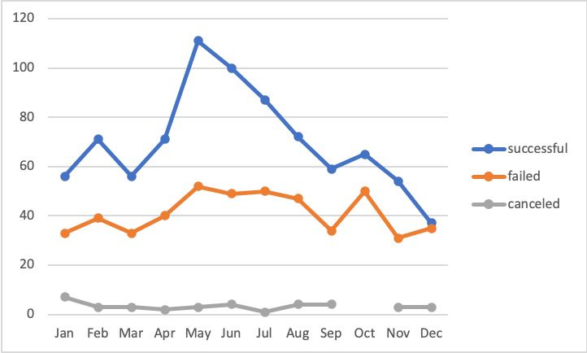
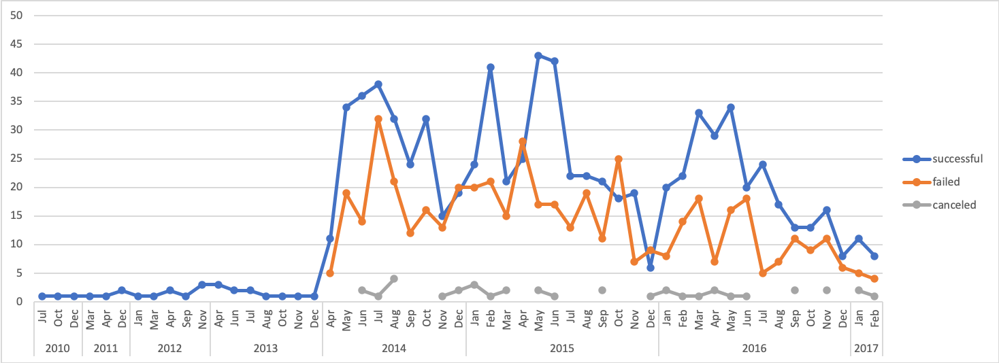
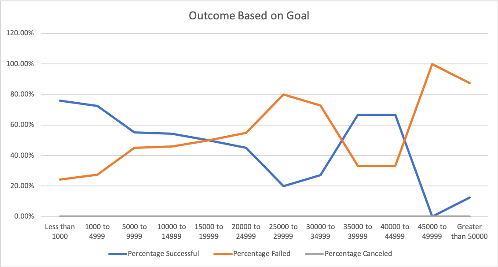
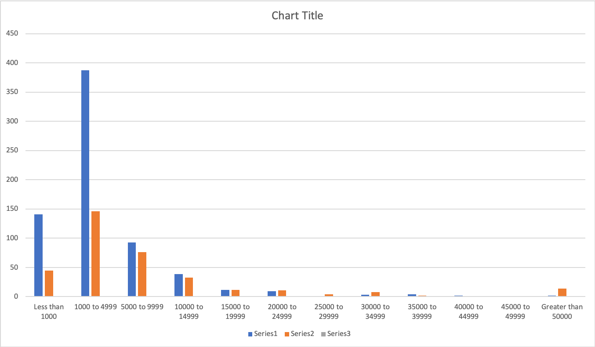

# Kickstarter-Analysis
Performing data analysis to uncover trends
## Overview of Project
### Purpose

A fund-raising campaign is initiated by a play-writer, Louise, for her upcoming theatre play, _Fever_, and she is keen to discover what are the key factors to drive the successful outcome of a fundraising campaign. In this report, a data analysis is carried out in order to help her to uncover whether or not the likelihood of a “successful” outcome of fundraising campaign for a theatre play is associated with its launch date and fundraising goal amount. 


## Analysis and Challenges

To help Louise, this research is conducted based on a dataset of a 4114 campaign projects samples. The dataset consists of valuable information of past campaign projects, which includes their: fundraising goal amount, the actual pledged amount, the campaign’s launch date and its ended date, the projects’ category, the country and the campaign’s outcome ( “successful”, “failed”, “live” or “cancelled”). We used Excel as the tool for examining this task and visualizing our result so the data can be more easily understood by a non-data analysis background individuals like Louise. 

### Part 1: Analysis of Outcomes Based on Launch Date

In the first part of our analysis, we focused on examining the change of outcomes number based on the launch date, specifically we are looking at how the outcomes fluctuate at each month . We begin our analysis by first reforming the data of launch date into regular “Year-Month-Day” form as the raw data included in the initial data sheet are in a form of “unix timestamp”, a form of expressing time into the number of second that have been spent since Jan 1st, 1970. We created a column called “Date created” by using the below codes:
>```=(((unix number/60)/60/24)+DATE(1970,1,1))``` 

to covert the unix form into date form and then formatted in date form. And then we created a new column called “Year” to extract the year of the “Date Created” column so that we are able to identify the range of year and later on use it as a filter when we organize the date. 

After the data is clean and ready to be analyzed, we use pivotable as the tool to conduct our research. The number of outcomes and its corresponding date are inputted into pivotable and “Year” and “Category” are used as filters. The below line chat shows that the fluctuation of outcomes for theatre campaign based on month from 2009 to 2017. Please note that label of each month means the total outcome of each month over the duration. For example, the number shown under “Jan”, means the total number of outcome for all the “Jan” from 2009 to 2017. 



According to the chart, the number of successful outcome hits the peak at May, which arrived 111. The least number of successful number happens in Dec, which is still higher than the number of failed and canceled at Dec. Furthermore, the overall count of successful outcome is higher than the overall count of failed and canceled respectively at each month.

#### Challenges and Difficulties Encountered for Part1
However this graph does not tell us how specifically the tendency of successful outcome has changed in each year. For example, in certain year like 2009, there is no theatre shows has been fundraised, while from 2011 to 2013 all theatre campaigns are successful. But as we are in year of 2020, is the data from 10 years ago still relevant to us? How the tendency in recent year tells us the story? To answer this question, We added the value of “Year” in the axis (Category), and we placed its order before “Date Created” so the graph shows the X-axis as the month of each year as below. 



It is clearly from the above chart that the number of successful outcome steadily remains below 5 per year from 2010 to 2013. Then in May of 2014, the total project of theatre shows dramatically climbed to 71, with 38 of them are successful. Followed by 2015, the magic May continues its legendary and achieved the highest number of successful campaign in that year. However, in both year 2015 and 2016, it is noticed that short after May, in June, the number of successful dropped dramatically and in March 2015 and Oct 2015 the failed counts outnumbers the successful number. **Overall, the Toal number of campaign and the number of successful campaigns shows a tendency of decreasing since 2016, _while the successful number remains higher than the failed ones at each month_**. 
 
 
### Analysis of Outcomes Based on Goals

In the second part of our research, we set up 12 intervals for goal amount range and tried to understand that how the percentage of successful outcome behaviours in each dollar amount goal range. We began with extracting the data from initial sheet by the COUNTITS function to count the number of outcomes based on filter “plays” and its goal amount. COUNTIFS functions allows us to count the number based on multiple condition. In this case, we use the following code to find the counts of "successful" outcomes for the goal amount "less than 1000"

>```=COUNTIFS(Sheet1!$D:$D, "<1000",Sheet1!$P:$P,"plays",Sheet1!$F:$F,"successful")```

Same logic applies to other cells. We collected a table of 36 data, which are the number under each goal amount range for outcome "successful", "canceled" and "failed". To summarize insightful information, we calculated the percentage of successful, failed and canceled under each goal amount range. And made the following line charts to show the trends. 



As shown from this chart, 75.8% of projects that is less than $1000 has a successful result from its campaign, which the percentage is the highest among all the goal amount range. The lowest rate of successful happened in the interval greater than $45000 and less than $49999, which is 0. It is interesting to notice that in the range from $1000-$4999 and $35000 to $44999, the probability of having a successful outcome is about 66.67% to 75.81%, which is superior than the other range.

### Challenges and Difficulties Encountered for Part2

One technical difficulty is that: when I were using the COUNTIFS function to input data, I find it is frustrating to manually change the goal amount in the condition for every cell. For example, I need to change the condition “<=number” every time when I moved to the next cell. And I cannot just simply drag the function to the next row’s cell as different rows are corresponding to different value range. I tried to google for the code to extract the value from the “goal” column by setting a function to copy the value before dash and paste into the condition. For example, copy “1000” from “1000 - 4999”. But then I stopped doing so because I find it is very time consuming. I wonder if there is better way to improve this process as in real life we may face dataset has many value and it is not the best way to manually change it.


## Results

### What are two conclusions you can draw about the Outcomes based on Launch Date?

1) The number of successful fundraising campaign tends to be higher in spring and summer, and tends to fall down in winter time. It will usually hit to the peak point in month of May then decrease to the lowest point in Dec. We would assume that setting launch date in May will likely have a higher possibility to be successful.

2) the trends of successful outcome changes in every 4 years. Data shows from 2009 to 2013, the successful numbers remains flat, while from 2014 to 2017 its starts to fluctuate dramatically during a year. 


### What can you conclude about the Outcomes based on Goals?
From our research, we can notice that in certain goal amount range, the number of successful outcome is higher than the other ranges. According to the given dataset, We can assume that if the goal amount is setting at less than $4999, the campaign will more likely to be successfuly

### What are some limitations of this dataset?
1) The sample size is relatively small for category theatre. Only 1393 samples are given in this task. In some year for example 2009, there is no theatre campaign was initiated. Small sample size will likely not represent the full pitcure and lead us to a wrong estimation on the result. 

2) The sample is relatively “old” - the database shows number from year 2009 to 2017. As we mentioned before in the challenge part A, the trends change over the years. For example from 2009 to 2013, the successful numbers remains flat, while from 2014 it starts to fluctuate. So more recent datasets will help us to determine the current trend and estimate the upcoming tendency. 
  
### What are some other possible tables and/or graphs that we could create?

When we examined the outcome based on goal amount, I noticed that some of the percentages may not be legit value to be used for this research. For example there is only 1 project in the range from $45000 to $49999 and it failed. Is this 0% successful rate actually valid? To answer this question and add more information, I created additional bar chart by inputing the number of outcomes and its corresponding range. 



The above bar chart tells us that the range from $1000 to $4999 has the most total number of projects, which is 553. When the goal amount is over $5000, the total project number starts to decrease and the number of successful and fail outcomes tends to be closed. It is interesting to advise that from the given database there is a noticeable more projects once the goal amount reached over $50000, with a total number of 16 projects and 14 of them failed. Overall, for project’s goal amount under $5000, the successful number is more than the failed number . 
